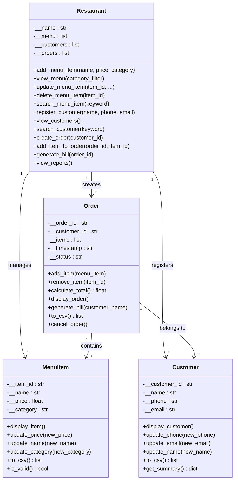

#  Restaurant Management System

> A fully object-oriented, console-based restaurant management application built in Python. 

---

##  Project Description

The **Restaurant Management System** is a Python-based command-line application that enables restaurant staff to manage the full lifecycle of a dining service. It supports:

- **Menu Management** — Add, view, update, delete and search menu items
- **Customer Registration** — Register and search customers
- **Order Management** — Create orders, add/remove items, calculate totals
- **Billing** — Generate detailed formatted bills
- **Sales Reporting** — View revenue statistics and popular items

All data is persisted automatically to CSV files, ensuring information survives across sessions.

---

##  Features

| Feature | Description |
|---|---|
| OOP Design | 4 classes: `MenuItem`, `Customer`, `Order`, `Restaurant` |
| CSV Persistence | All data auto-saved to `data/` on every change |
| Interactive Menu | Numbered console menu running in a `while` loop |
| Validation | Input validation with descriptive error messages |
| Exception Handling | `try/except/finally` throughout all I/O operations |
| Search | Search menu items and customers by keyword |
| Sales Report | Total revenue, avg order value, most popular item |
| PEP 8 Compliant | Docstrings, type hints, meaningful names, clean formatting |
| Modular Design | Separated into 5 `.py` files + a `data/` directory |

---

##  Project Structure

```
Restaurant_Management_System/
├── main.py          # Entry point — interactive menu loop
├── menu_item.py     # MenuItem class + CSV helpers
├── customer.py      # Customer class + CSV helpers
├── order.py         # Order class + CSV helpers
├── restaurant.py    # Restaurant controller class
├── data/
│   ├── menu.csv        # Persisted menu items
│   ├── customers.csv   # Persisted customer records
│   └── orders.csv      # Persisted order history
└── README.md
```

---

##  Installation & Requirements

**Prerequisites:**
- Python 3.10 or later (uses built-in libraries only)
- No third-party packages required

**Clone or download the project:**
```bash
# If using Git:
git clone <your-repo-url>
cd Restaurant_Management_System
```

---

## ▶ How to Run

```bash
# Navigate to the project directory
cd Restaurant_Management_System

# Run the application
python main.py
```

The system will automatically load sample data from the `data/` CSV files on startup.

---

##  Main Menu

```
  ╔══════════════════════════════╗
  ║         MAIN  MENU           ║
  ╚══════════════════════════════╝

  ─── MENU MANAGEMENT ───
    1. Add Menu Item
    2. View Menu
    3. Update Menu Item
    4. Delete Menu Item
    5. Search Menu Item

  ─── CUSTOMER MANAGEMENT ───
    6. Register Customer
    7. View Customers
    8. Search Customer

  ─── ORDER MANAGEMENT ───
    9. Create Order
   10. View Orders
   11. Generate Bill
   12. View Sales Report

    0. EXIT
```

---

##  Example Usage

### Adding a Menu Item
```
  Enter your choice: 1

  — Add Menu Item —
  Item Name: Truffle Pasta
  Price: 12.99
  Category: Pasta

  ✓ Menu item 'Truffle Pasta' added with ID 'M019'.
```

### Generating a Bill
```
  ============================================
           🍽  RESTAURANT BILL  🍽
  ============================================
  Customer  : John Smith
  Order ID  : ORD001
  Date/Time : 2026-06-10 12:30:00
  ============================================
  Classic Beef Burger            $5.99
  Coca-Cola                      $1.99
  ============================================
  TOTAL                          $7.98
  ============================================
       Thank you for dining with us!
```

### Sales Report
```
  ==================================================
             📊  SALES REPORT  📊
  ==================================================
  Restaurant     : The Grand Bistro
  Total Orders   : 5
  Billed Orders  : 4
  Open Orders    : 1
  ==================================================
  Total Revenue  : $50.40
  Avg Order Value: $12.60
  Most Popular   : Coca-Cola (2 orders)
  ==================================================
```

---

##  Technologies Used

| Technology | Purpose |
|---|---|
| Python 3.10+ | Core programming language |
| `csv` module | CSV file reading and writing |
| `os` module | File path management |
| `re` module | Email validation with regex |
| `datetime` module | Order timestamping |
| `sys` module | Clean exit handling |

---

##  Class Overview (UML)



---

